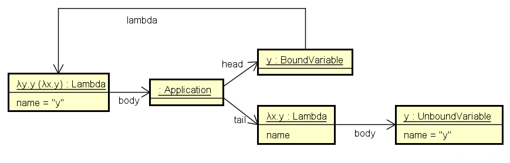

# Javaによるラムダ計算の実装

このプログラムはJavaで
[ラムダ計算](https://ja.wikipedia.org/wiki/%E3%83%A9%E3%83%A0%E3%83%80%E8%A8%88%E7%AE%97)
を実装したものです。

## 文法

EBNFで記述した文法は以下のようになります。

```
式     = 因子 { 因子 }

因子   = 変数
       | ラムダ
       | '(' 式 ')'

ラムダ = 変数 '.' 因子
       | 'λ' 変数 { 変数 } '.' 式
       | '\' 変数 { 変数 } '.' 式
```

### 変数

変数はJavaの識別子として使える文字は`$`と`λ`を除いてすべて使えます。
数字や `+`,  `-`,  `*`,  `/`, `&`, `|`,  `!`, `^`, `%` も使えます。

### ラムダ

[Wikipedia](https://ja.wikipedia.org/wiki/%E3%83%A9%E3%83%A0%E3%83%80%E8%A8%88%E7%AE%97)
に記述されている文法の内、ラムダ式の表記法を拡張しています。
通常のラムダ式は以下のように記述します。

```
λx y.x y
```

これは`x`と`y`を受け取って`x y` (`x`に`y`を適用する)を返す式です。

このプログラムではこれを以下のように表記することができます。

1. `λx.λy.x y` - カリー化（単一の引数に限定）した表記
1. `\x y.x y` - `λ`を`\`で表記
1. `\x.\y.x y` - `\`表記をカリー化した表記
1. `x.y.x y` - カリー化して`λ`を省略した表記

`λ`はすべてのラムダ式をカリー化した場合のみ省略することができます。
`λ`を省略した場合、ラムダ式を構成する`.`は演算子と考えることができます。
これは右結合の演算子で、`x.y.x`は`x.(y.x)`と同じです。

### 適用

`t s` は`t`に`s`を適用することを表します。
これは関数`t(x)`に対して引数`s`を適用して呼び出すことに相当します。
適用は右結合の演算子と考えることができます。
そのため`x y z`は`(x y) z`と同じ意味になります。
`x.y.z.x y z`は`x.(y.(z.((x y) z)))`と同じです。

## コマンドラインからの実行

コマンドラインから実行する方法は以下のとおりです。

<pre><code>C:\Users\saka1029> <b>java -jar LambdaCalculus.jar</b>
% <b>(x.x C) V</b>
V C
% <b>exit</b></code></pre>

プロンプト`% `に続けて
式をタイプするとそれを簡約した結果が表示されます。
`exit`とタイプするとプログラムは終了します。

### 実行例

[チャーチ数](https://ja.wikipedia.org/wiki/%E3%83%A9%E3%83%A0%E3%83%80%E8%A8%88%E7%AE%97#.E8.87.AA.E7.84.B6.E6.95.B0.E3.81.A8.E7.AE.97.E8.A1.93)
は自然数をラムダ式として表現したものです。
Wikipediaの記述をそのままコマンドラインで実行すると以下のようになります。


    % define 0 λa b.b
    λa b.b
    % define 1 λa b.a b
    λa.a
    % define 2 λa b.a (a b)
    λa b.a (a b)
    % define 3 λa b.a (a (a b))
    λa b.a (a (a b))
    % define SUCC λn f x.f (n f x)
    λn f x.f (n f x)
    % define PLUS λm n f.λx.m f (n f x)
    λm n f x.m f (n f x)
    % define MULT λm n f.m (n f)
    λm n f.m (n f)
    % SUCC 0
    λf.f
    % SUCC (SUCC 1)
    λf x.f (f (f x))
    % PLUS 2 3
    λf x.f (f (f (f (f x))))
    % MULT 2 3
    λf b.f (f (f (f (f (f b)))))
    
 
### 組み込みコマンド

* **exit**, **quit** - プログラムを終了します。

### 組み込み関数

* **`define V E`** - `E`を簡約した結果を変数`V`に設定します。

## API

## 正規化

Term#equals()は字面で比較を行うので`x.x`と`y.y`は等しくなりません。
式としての等値性を調べる場合は、それぞれを正規化してから比較する必要があります。
正規化する場合はTerm#normalize()を使用します。

    Context c = defaultContext();
    Term xx = term("x.x");
    Term yy = term("y.y");
    assertNotEquals(yy, xx);
    assertEquals(yy.normalize(), xx.normalize());

`x.x`や`y.y`を正規化した結果はどちらも以下のようになります。

    $0.$0
    
式の先頭からみて束縛変数が出現する都度それを`$0`, `$1` ... に置換します。
冒頭で述べたように`$`を含む変数は使用できないので注意してください。
これはParserが`$`の使用を制限しているだけなので、
正規化した結果を簡約すること自体は可能です。

## η-変換

η-変換は束縛変数の名前を変更する処理です。
例えば以下の式を簡約してみます。

    (λx.λy.y x) (λx.y)
    
何も考えずに`x`を`λx.y`で置換すると以下のようになります。

    λy.y (λx.y)
    
元の式の最後にあった`y`は自由変数ですが、
置換後の式の最後にある`y`は束縛変数のように見えます。
この場合に以下のような式に変換するのがη-変換です。

    λz.z (λx.y)

このプログラムではη-変換を実装していません。
η-変換を行わなくても簡約が正しく行われるようにしているためです。
このことを理解するためにはクラスの構成を見てみる必要があります。
このプログラムの簡単なクラス図は以下のようになっています。


`Variable`は変数を表すインタフェースですが、
`BoundVariable`と`UnboundVariable`の二つの実装があります。
`BoundVariable`はいずれかのラムダ式に束縛されている束縛変数です。
自分自身を束縛している`Lambda`を参照しています。
`UnboundVariable`はどのラムダ式にも束縛されていない自由変数です。

例えば`λx.λy.x K`のインスタンスは以下のようになります。


インスタンス`x:BoundVariable`は自分が属するラムダ式への参照を持っています。
インスタンス`K:UnboundVariable`は
どこからも束縛されていないので`UnboundVariable`のインスタンスになります。

先の置換結果(`λy.y (λx.y)`)のインスタンスは以下のようになります。



同じ名前の変数`y`が`BoundVariable`と`UnboundVariable`に分類されていることがわかります。

この実装では簡約の途中で同一名の束縛変数と自由変数が同じ文脈に出現しても
区別されるのでη-変換は不要となります。


## 制限事項

### Term#toString()

Term#toString()は式の文字列表現を返しますが、
正しくない表現を返す場合があります。
例えば以下の式を簡約してみます。

```
(x.y.y x) (x.y)
```

末尾にある`y`は先頭のラムダ式とは無関係なので自由変数です。
簡約した結果は以下のようになります。

```
y.y x.y
```

最後の`y`はどう見ても束縛変数です。
ただし、これはTerm#toString()の問題で、
結果の式を正規化(Term#normalize())すると以下が得られます。

```
$0.$0 $1.y
```

最後の`y`は正しく自由変数として認識されていることがわかります。
本来であればη-変換を行って

```
z.z x.y
```

のような結果を返すべきですが、
η-変換を実装していないのでこのような結果になります。
単に表記の問題で簡約を行う上では支障はありません。